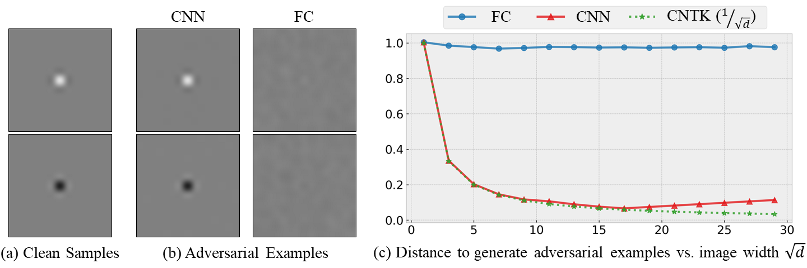

# Shift Invariance Can Reduce Adversarial Robustness

This repo contains the code to reproduce the experimental results in the paper: https://arxiv.org/abs/2103.02695. We show theoretically that shift invariance can undermine adversarial robustness, and experimentally that this is indeed the case on real-world networks.



As shown in the Figure above, in a binary classification problem as shown in (a), with each image as a distinct class, a FC network requires an average L2 distance close to **1** to construct an adversarial example while a shift-invariant CNN only requires approximately **1/√d** as illustrated in (c), where d is the input dimension. The curve labeled CNN shows results for a real trained network, while CNTK shows the theoretically derived prediction of 1/√d for an infinitely wide network. We visualized the adversarial examples for d=225 of both models in (b). Note that the change is imperceptible for the CNN.

## Usage

#### Experiments on the Motivating Examples in the Figure

To reproduce the experiments for Figure 1 of the paper, run  <code>python toy/simple.py</code>.

#### Experiments in Section 5.1.1 (CNN vs. FC on MNIST and FMNIST)

To train models on MNIST use <code>python 5_1_1/train_mnist_full.py</code> 
and specify the parameters for network architecture and 
adversarial attack to use. Use the --fashion-mnist flag
to train FashionMNIST dataset.

#### Experiments in Section 5.1.2 (CNNs with Different Levels of Shift Invariance)

To train CNNs with different level of shift-invairnce on MNIST, follow the script `5_1_2/run_mnist_padding.sh`.

#### Experiments in Section 5.1.4 (ResNets vs. FC Nets on SVHN)

To train models on SVHN dataset use `5_1_4/python train_svhn.py`,
 with required parameters. To evaluate robustness of trained models,
 use `5_1_4/python eval_svhn.py`.
 
#### Experiments in Section 5.1.5 (Realistic networks on Cifar-10 and ImageNet)
 
* Cifar10 models are obtained with code from https://github.com/kuangliu/pytorch-cifar.
 To test performance, on CIFAR-10 use `python 5_1_5/test_cifar.py`  
* ImageNet models are obtained from pytorch model zoo .Use `python 5_1_5/test_imagenet.py` for evaluation and specify the
 model architecture using `--model` argument. 
* To test robustness of Vision Transformers use `python 5_1_5/test_vit_imagenet.py`
* To train a Sparse MLP on CIFAR-10 following [1], use `python 5_1_5/train_cifar_sparse_mlp.py`. There's
    a few differences between our training and original paper, we use default data augmentations instead of 
    fastautoaugment as proposed in the paper and train for 2000 epochs instead of 4000. 
    We trained with different lambda values as proposed in the paper for our results.
 
 
#### Experiments in Section 5.2 (Realistic networks on Cifar-10 and ImageNet)

For results on Table 1 and Table 2, use ``5_2/orthogonal_vectors.ipynb`` to
 train on orthogonal vectors and ``5_2/Frequency Adversarial.ipynb`` to train on orthogonal frequencies.
 
#### References
[1] Towards Learning Convolutions from Scratch (https://arxiv.org/abs/2007.13657)


## Citation
```
@article{ge2021shift,
  title={Shift Invariance Can Reduce Adversarial Robustness},
  author={Ge, Songwei and Singla, Vasu and Basri, Ronen and Jacobs, David},
  journal={arXiv preprint arXiv:2103.02695},
  year={2021}
}
```
